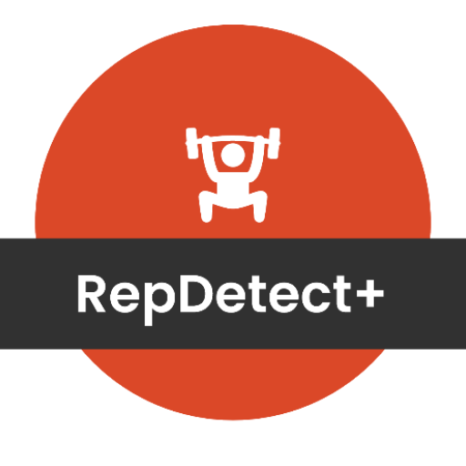

# MoovFit

**MoovFit** is an Android fitness application that uses on-device pose detection to track exercises via camera in real time. It counts repetitions automatically using a K-NN classifier, identifies 10+ exercises (squats, push-ups, yoga poses, etc.), and provides real-time posture correction feedback. A Python FastAPI backend is available for server-side analytics and ML model training.

<p align="center">
  
</p>

---

## Table of Contents

- [Features](#features)
- [Tech Stack](#tech-stack)
- [Project Structure](#project-structure)
- [How It Works](#how-it-works)
- [Setup](#setup)
- [Backend API](#backend-api)
- [License](#license)

---

## Features

| Feature | Details |
|---|---|
| **Pose Detection** | Real-time body tracking using Google ML Kit Pose Detection (33 landmarks) |
| **Exercise Classification** | K-NN classifier trained on landmark embeddings to identify 10 exercises |
| **Rep Counting** | Automatic repetition counting with configurable enter/exit thresholds |
| **Posture Correction** | Real-time angle checks and form feedback for 9 exercises |
| **Workout Plans** | Create weekly plans with specific exercises, reps, and calories |
| **History & Analytics** | Room DB local storage + weekly charts (MPAndroidChart) |
| **Authentication** | JWT-based login/register (backend) |
| **Dark Mode** | Full dark theme support |

**Supported exercises:** Squats, Push-ups, Lunges, Sit-ups, Deadlifts, Chest Press, Shoulder Press, Pull-ups, Dips, Tree Yoga, Warrior Yoga

---

## Tech Stack

### Android

| Layer | Technology |
|---|---|
| Language | Kotlin + Java |
| Camera | CameraX (Camera2, Lifecycle, View) |
| Pose Detection | ML Kit Pose Detection Accurate (18.0.0-beta3) |
| Classification | K-NN with EMA Smoothing + Outlier Filtering |
| Database | Room (SQLite) |
| Navigation | Navigation Component + Safe Args |
| Networking | Retrofit 2 + OkHttp 4 |
| Charts | MPAndroidChart |
| DI / Patterns | ViewModel + LiveData, Repository |
| UI | View & Data Binding, Material Design 3 |
| Auth | JWT, SharedPreferences |
| GIF | android-gif-drawable, Glide |

### Backend (optional)

| Component | Technology |
|---|---|
| Framework | FastAPI (Python) |
| Database | SQLAlchemy + PostgreSQL/SQLite |
| ML | scikit-learn (KNN), MediaPipe |
| Auth | JWT (python-jose), bcrypt (passlib) |
| Deployment | Heroku (Procfile) |

---

## Project Structure

```
MoovFit/
├── app/                                    # Android application module
│   ├── build.gradle                        # App-level dependencies
│   ├── proguard-rules.pro
│   └── src/
│       └── main/
│           ├── AndroidManifest.xml
│           ├── assets/
│           │   ├── pose/                   # CSV training data (10 exercises)
│           │   │   ├── squats.csv
│           │   │   ├── pushups.csv
│           │   │   ├── lunges.csv
│           │   │   ├── situps.csv
│           │   │   ├── deadlift.csv
│           │   │   ├── chestpress.csv
│           │   │   ├── shoulderpress.csv
│           │   │   ├── treeyoga.csv
│           │   │   └── warrioryoga.csv
│           │   └── repdetect_database.db   # Pre-populated Room database
│           ├── java/com/example/poseexercise/
│           │   ├── adapters/               # RecyclerView adapters
│           │   │   ├── ExerciseAdapter.kt
│           │   │   ├── ExerciseGifAdapter.kt
│           │   │   ├── PlanAdapter.kt
│           │   │   ├── RecentActivityAdapter.kt
│           │   │   └── WorkoutAdapter.kt
│           │   ├── data/                   # Data layer
│           │   │   ├── PostureFeedback.kt
│           │   │   ├── PostureResult.kt
│           │   │   ├── database/
│           │   │   │   ├── AppDatabase.kt  # Room database singleton
│           │   │   │   └── AppRepository.kt
│           │   │   ├── plan/               # Plan entity + DAO
│           │   │   │   ├── Constants.kt
│           │   │   │   ├── Exercise.kt
│           │   │   │   ├── PlanDataDao.kt
│           │   │   │   └── PlanEntity.kt
│           │   │   └── results/            # WorkoutResult entity + DAO
│           │   │       ├── RecentActivityItem.kt
│           │   │       ├── WorkoutResult.kt
│           │   │       └── WorkoutResultDao.kt
│           │   ├── network/                # Retrofit + API models
│           │   │   ├── ApiClient.kt
│           │   │   ├── ApiModels.kt
│           │   │   ├── ApiService.kt
│           │   │   └── AuthManager.kt
│           │   ├── onboarding/             # Tutorial slides
│           │   │   ├── FirstOnboardingFragment.kt
│           │   │   ├── SecondOnboardingFragment.kt
│           │   │   ├── ThirdOnboardingFragment.kt
│           │   │   └── OnboardingPagerAdapter.kt
│           │   ├── posedetector/           # Core ML pipeline
│           │   │   ├── PoseDetectorProcessor.kt
│           │   │   ├── PostureCorrector.kt
│           │   │   └── classification/     # K-NN classification engine
│           │   │       ├── ClassificationResult.java
│           │   │       ├── EMASmoothing.java
│           │   │       ├── PoseClassifier.java
│           │   │       ├── PoseClassifierProcessor.java
│           │   │       ├── PoseEmbedding.java
│           │   │       ├── PoseSample.java
│           │   │       ├── RepetitionCounter.java
│           │   │       └── Utils.java
│           │   ├── util/                   # Utilities
│           │   │   ├── BitmapUtils.java
│           │   │   ├── FrameMetadata.java
│           │   │   ├── MemoryManagement.kt
│           │   │   ├── MyApplication.kt
│           │   │   ├── MyUtils.kt
│           │   │   ├── ScopedExecutor.java
│           │   │   ├── VisionImageProcessor.java
│           │   │   └── VisionProcessorBase.java
│           │   ├── viewmodels/             # ViewModels
│           │   │   ├── AddPlanViewModel.kt
│           │   │   ├── CameraXViewModel.java
│           │   │   ├── HomeViewModel.kt
│           │   │   ├── ResultViewModel.kt
│           │   │   └── WorkoutViewHolder.kt
│           │   └── views/
│           │       ├── activity/           # Activities
│           │       │   ├── SplashActivity.kt
│           │       │   ├── LoginActivity.kt
│           │       │   ├── RegisterActivity.kt
│           │       │   ├── OnboardingActivity.kt
│           │       │   └── MainActivity.kt
│           │       ├── fragment/           # Fragments
│           │       │   ├── HomeFragment.kt
│           │       │   ├── WorkOutFragment.kt
│           │       │   ├── PlanStepOneFragment.kt
│           │       │   ├── PlanStepTwoFragment.kt
│           │       │   ├── ProfileFragment.kt
│           │       │   ├── CompletedFragment.kt
│           │       │   ├── CancelFragment.kt
│           │       │   └── preference/
│           │       │       └── PreferenceUtils.java
│           │       └── graphic/            # Overlay graphics
│           │           ├── CameraImageGraphic.java
│           │           ├── GraphicOverlay.java
│           │           └── PoseGraphic.kt
│           └── res/                        # Resources
│               ├── drawable/               # Icons, shapes, images
│               ├── layout/                 # XML layouts (21 files)
│               ├── navigation/nav_graph.xml
│               ├── values/                 # strings, colors, themes, dimens
│               ├── values-night/           # Dark theme
│               └── xml/                    # Backup rules
├── backend/                                # Python FastAPI backend
│   ├── app/
│   │   ├── main.py                        # FastAPI entry point
│   │   ├── config.py                      # Environment configuration
│   │   ├── database.py                    # SQLAlchemy engine
│   │   ├── api/
│   │   │   └── routes.py                  # Auth, plans, workouts, analytics endpoints
│   │   ├── models/
│   │   │   └── models.py                  # User, Plan, WorkoutResult ORM models
│   │   ├── schemas/
│   │   │   └── schemas.py                 # Pydantic request/response schemas
│   │   ├── services/
│   │   │   └── auth.py                    # JWT + password hashing
│   │   └── ml/
│   │       └── trainer.py                 # KNN training, form analysis, pose prediction
│   ├── requirements.txt
│   ├── Procfile                           # Heroku deployment
│   └── .env.example
├── gradle/
│   └── wrapper/
├── .github/workflows/AndroidBuild.yml     # CI pipeline
├── build.gradle                           # Root Gradle config
├── settings.gradle
├── gradle.properties
├── gradlew / gradlew.bat
├── .gitignore
├── UML_DIAGRAMS.md
├── RepDetect_Dossier_Technique.docx
└── LICENSE.txt
```

---

## How It Works

### Pose Detection Pipeline

```
Camera Frame → ML Kit PoseDetector → 33 Landmarks
                                        ↓
                                  PoseEmbedding
                                (pairwise distances
                                 + joint angles)
                                        ↓
                               K-NN Classifier
                          (top-K nearest neighbors
                           with outlier filtering)
                                        ↓
                              EMA Smoothing
                           (10-frame sliding window)
                                        ↓
                          ┌──────────────────────┐
                          │  RepetitionCounter   │
                          │  (enter threshold > 6 │
                          │   exit threshold < 4) │
                          └──────────────────────┘
                                        ↓
                          PostureResult (exercise
                          name + rep count + confidence)
```

### 1. Pose Detection

Each camera frame is sent to **ML Kit Pose Detection (accurate)** which returns 33 body landmarks (shoulders, elbows, wrists, hips, knees, ankles, etc.) with 3D coordinates.

### 2. Pose Embedding

`PoseEmbedding.java` converts raw landmarks into a feature vector by computing:
- **Pairwise distances** between key joints
- **Joint angles** (elbow, knee, hip, shoulder angles)

This creates a rotation/scale-invariant representation.

### 3. K-NN Classification

`PoseClassifier.java` compares the live embedding against pre-recorded CSV training data (10 exercises × multiple samples) using:
- **K-NN** with K=5 (configurable)
- **Outlier filtering**: removes distant samples before computing final confidence

### 4. EMA Smoothing

`EMASmoothing.java` applies exponential moving average over a 10-frame window to reduce jitter and produce stable classifications.

### 5. Repetition Counting

`RepetitionCounter.java` tracks state transitions:
- **Enter threshold**: confidence > 6 → pose entered
- **Exit threshold**: confidence < 4 → pose exited → rep counted

### 6. Posture Correction

`PostureCorrector.kt` analyzes joint angles for 9 exercises and provides real-time form feedback:
- Squat: knee angle, back angle, hip depth
- Push-up: elbow angle, body alignment
- Lunge: front knee angle, back knee angle
- Etc.

### 7. On-Device vs Server

| Processing | Location | Latency |
|---|---|---|
| Pose Detection | On-device (ML Kit) | < 30ms |
| Exercise Classification | On-device (K-NN) | < 5ms |
| Rep Counting | On-device | < 1ms |
| Model Training | Backend (scikit-learn) | Offline |
| Analytics | Backend (FastAPI) | API call |

---

## Setup

### Prerequisites

- Android Studio Hedgehog (2023.1.1) or later
- JDK 17
- Android SDK 34
- Gradle 8.x
- Python 3.10+ (for backend)

### Android App

```bash
# 1. Open the project in Android Studio
# 2. Let Gradle sync finish
# 3. Build and run:
./gradlew assembleDebug
```

The APK will be generated at `app/build/outputs/apk/debug/app-debug.apk`.

### Backend Server (optional)

```bash
cd backend

# Create virtual environment
python -m venv venv
source venv/bin/activate  # or `venv\Scripts\activate` on Windows

# Install dependencies
pip install -r requirements.txt

# Configure environment
cp .env.example .env
# Edit .env with your settings

# Run the server
uvicorn app.main:app --reload --port 5000
```

The server will be available at `http://localhost:5000/`. For emulator testing, the app uses `http://10.0.2.2:5000/`.

### CI/CD

The project includes a GitHub Actions workflow (`.github/workflows/AndroidBuild.yml`) that builds the app on every push.

---

## Backend API

| Method | Endpoint | Description |
|---|---|---|
| POST | `/api/auth/register` | Register a new user |
| POST | `/api/auth/login` | Login, returns JWT token |
| GET | `/api/auth/me` | Get current user info |
| GET | `/api/plans` | List workout plans |
| POST | `/api/plans` | Create a plan |
| PUT | `/api/plans/{id}` | Update a plan |
| DELETE | `/api/plans/{id}` | Delete a plan |
| GET | `/api/workouts` | List workout results |
| POST | `/api/workouts` | Log a workout result |
| POST | `/api/workouts/batch` | Batch insert workouts |
| DELETE | `/api/workouts/{id}` | Delete a workout |
| GET | `/api/summary` | Get workout summary |
| GET | `/api/analytics/weekly` | Weekly stats |
| GET | `/api/analytics/exercises/{name}` | Per-exercise analytics |
| GET | `/api/analytics/streak` | User streak data |
| GET | `/health` | Health check |

---

## License

This project is licensed under the terms included in [LICENSE.txt](LICENSE.txt).
