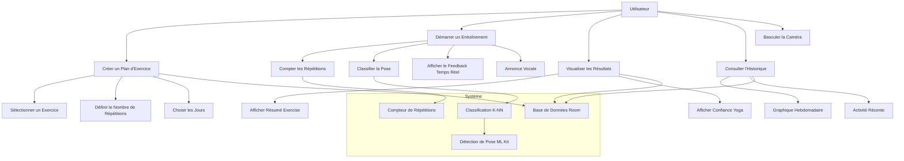
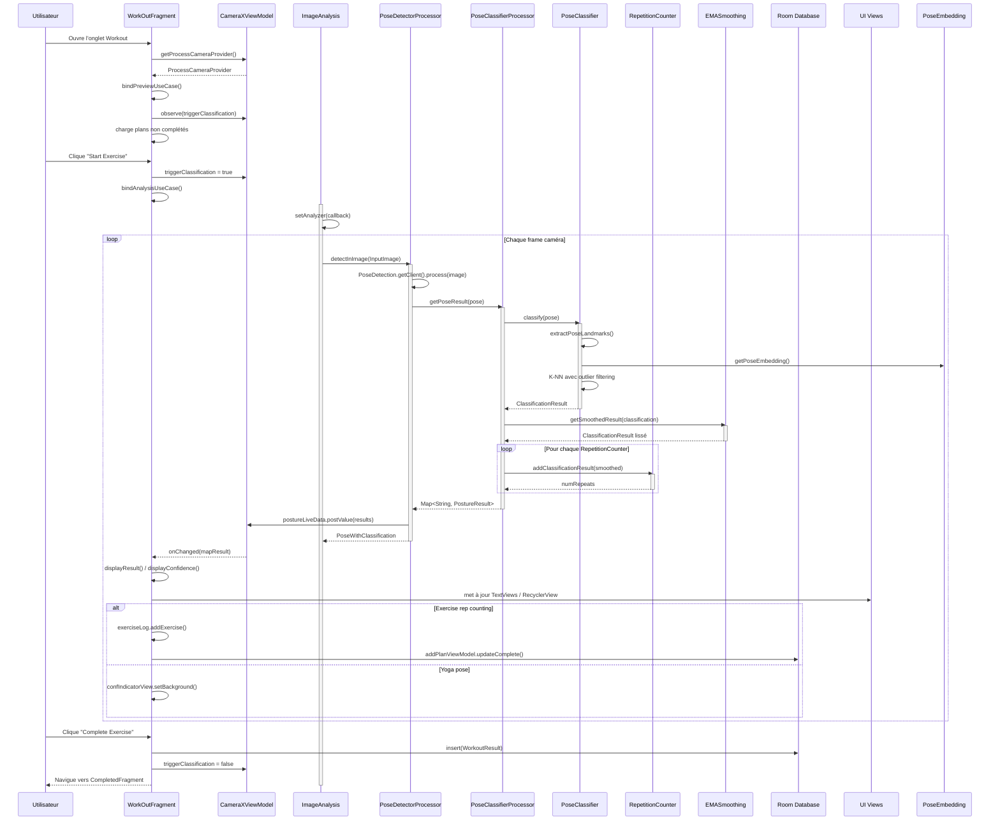
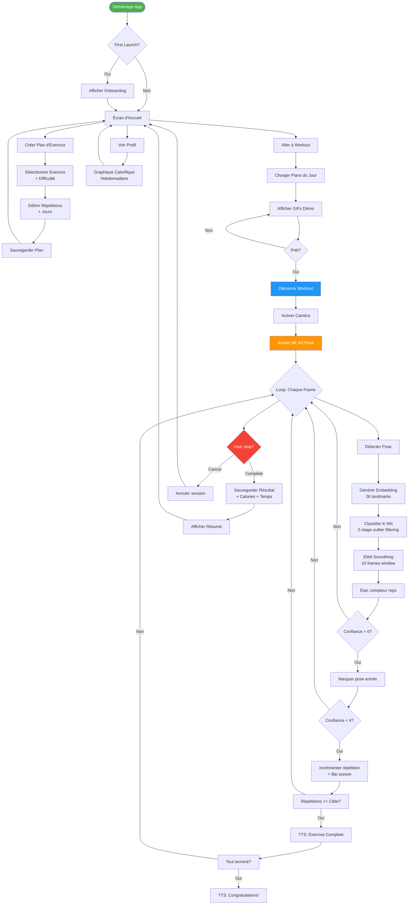

# Diagrammes UML - RepDetect (Coach Sportif Mobile)

## 1. Diagramme de Cas d'Utilisation

## 2. Diagramme de Classes

```mermaid
classDiagram
    %% ===== Activities =====
    class SplashActivity {
        +onCreate()
    }
    class OnboardingActivity {
        -viewPager2: ViewPager2
        +onCreate()
    }
    class MainActivity {
        -binding: ActivityMainBinding
        -navController: NavController
        +workoutResultData: String
        +workoutTimer: String
        +onCreate()
        +onSupportNavigateUp(): Boolean
    }

    %% ===== Fragments =====
    class HomeFragment {
        -homeViewModel: HomeViewModel
        +onCreateView()
    }
    class WorkOutFragment {
        -cameraViewModel: CameraXViewModel
        -resultViewModel: ResultViewModel
        -addPlanViewModel: AddPlanViewModel
        -textToSpeech: TextToSpeech
        -notCompletedExercise: List~Plan~
        -exerciseLog: ExerciseLog
        +onCreateView()
        +clearMemory()
        -bindAllCameraUseCases()
        -bindAnalysisUseCase()
        -displayConfidence()
        -displayResult()
        -synthesizeSpeech()
    }
    class PlanStepOneFragment {
        -addPlanViewModel: AddPlanViewModel
        +onCreateView()
    }
    class PlanStepTwoFragment {
        -addPlanViewModel: AddPlanViewModel
        +onCreateView()
    }
    class ProfileFragment {
        -resultViewModel: ResultViewModel
        +onCreateView()
    }
    class CompletedFragment {
        +onCreateView()
    }
    class CancelFragment {
        +onCreateView()
    }
    class OnboardingFragment {
        <<abstract>>
    }

    %% ===== ViewModels =====
    class CameraXViewModel {
        -cameraProviderLiveData: MutableLiveData~ProcessCameraProvider~
        -postureLiveData: MutableLiveData~Map~String, PosturResult~~
        -triggerClassification: MutableLiveData~Boolean~
        +getProcessCameraProvider(): LiveData
        +getPostureLiveData(): MutableLiveData
        +getTriggerClassification(): MutableLiveData
    }
    class HomeViewModel {
        -repository: AppRepository
        +getNotCompletePlans(): List~Plan~
    }
    class AddPlanViewModel {
        -repository: AppRepository
        +insertPlan()
        +updateComplete()
        +deletePlan()
    }
    class ResultViewModel {
        -repository: AppRepository
        +insert()
        +getAllResult()
        +getRecentWorkout()
    }

    %% ===== Data Layer =====
    class AppDatabase {
        <<singleton>>
        +getDatabase(): AppDatabase
        +planDao(): PlanDataDao
        +resultDao(): WorkoutResultDao
    }
    class AppRepository {
        -planDao: PlanDataDao
        -resultDao: WorkoutResultDao
        +allPlans: LiveData~List~Plan~~
        +insertPlan()
        +updatePlan()
        +deletePlan()
        +insertResult()
        +getRecentWorkout()
    }
    class Plan {
        <<Room Entity>>
        +id: Int
        +exercise: String
        +calories: Double
        +repeatCount: Int
        +selectedDays: String
        +completed: Boolean
        +timeCompleted: Long?
    }
    class WorkoutResult {
        <<Room Entity>>
        +id: Int
        +exerciseName: String
        +repeatedCount: Int
        +confidence: Float
        +timestamp: Long
        +calorie: Double
        +workoutTimeInMin: Double
    }
    class PlanDataDao {
        <<interface / DAO>>
        +getAll(): LiveData~List~Plan~~
        +getPlansByDay(): List~Plan~
        +getNotCompletePlanByDay(): MutableList~Plan~
        +insert()
        +update()
        +addCompletedTime()
        +deletePlan()
    }
    class WorkoutResultDao {
        <<interface / DAO>>
        +getAll(): List~WorkoutResult~
        +getRecentWorkout(): List~WorkoutResult~
        +insert()
    }
    class PostureResult {
        +repetition: Int
        +confidence: Float
        +postureType: String
    }
    class ExerciseLog {
        +addExercise()
        +getExerciseData(): ExerciseData
        +getExerciseDataList(): List~ExerciseData~
        +areAllExercisesCompleted(): Boolean
    }
    class ExercisePlan {
        +planId: Int?
        +exerciseName: String
        +repetitions: Int
    }

    %% ===== Pose Detection =====
    class PoseDetectorProcessor {
        -detector: PoseDetector
        -poseClassifierProcessor: PoseClassifierProcessor
        -cameraXViewModel: CameraXViewModel
        +detectInImage(): Task~PoseWithClassification~
        +onSuccess()
        +onFailure()
        +stop()
    }
    class PoseClassifierProcessor {
        -poseClassifier: PoseClassifier
        -emaSmoothing: EMASmoothing
        -repCounters: List~RepetitionCounter~
        +getPoseResult(): Map~String, PostureResult~
    }
    class PoseClassifier {
        -poseSamples: List~PoseSample~
        -MAX_DISTANCE_TOP_K: int
        -MEAN_DISTANCE_TOP_K: int
        +classify(): ClassificationResult
        +confidenceRange(): int
    }
    class PoseEmbedding {
        +getPoseEmbedding(): List~PointF3D~
    }
    class PoseSample {
        +getClassName(): String
        +getEmbedding(): List~PointF3D~
        +getPoseSample(): PoseSample
    }
    class ClassificationResult {
        +incrementClassConfidence()
        +getClassConfidence(): float
        +getMaxConfidenceClass(): String
        +getAllClasses(): Set~String~
        +putClassConfidence()
    }
    class RepetitionCounter {
        -className: String
        -numRepeats: int
        -poseEntered: boolean
        -enterThreshold: float
        -exitThreshold: float
        +addClassificationResult(): int
        +getNumRepeats(): int
        +getClassName(): String
    }
    class EMASmoothing {
        -window: Deque~ClassificationResult~
        -alpha: float
        -windowSize: int
        +getSmoothedResult(): ClassificationResult
    }

    %% ===== Graphic =====
    class GraphicOverlay {
        +add()
        +clear()
        +setImageSourceInfo()
    }
    class PoseGraphic {
        -pose: Pose
        +draw()
    }

    %% ===== Relationships =====

    %% Activities -> Fragments
    MainActivity --> HomeFragment : navigue vers
    MainActivity --> WorkOutFragment : navigue vers
    MainActivity --> PlanStepOneFragment : navigue vers
    MainActivity --> ProfileFragment : navigue vers

    %% Fragments -> ViewModels
    WorkOutFragment --> CameraXViewModel : observe
    WorkOutFragment --> ResultViewModel : utilise
    WorkOutFragment --> AddPlanViewModel : utilise
    WorkOutFragment --> HomeViewModel : utilise
    HomeFragment --> HomeViewModel : observe
    ProfileFragment --> ResultViewModel : observe
    PlanStepOneFragment --> AddPlanViewModel : utilise
    PlanStepTwoFragment --> AddPlanViewModel : utilise

    %% ViewModels -> Repository
    HomeViewModel --> AppRepository
    AddPlanViewModel --> AppRepository
    ResultViewModel --> AppRepository

    %% Repository -> Database
    AppRepository --> AppDatabase
    AppDatabase --> PlanDataDao
    AppDatabase --> WorkoutResultDao
    PlanDataDao --> Plan
    WorkoutResultDao --> WorkoutResult

    %% Pose Detection Pipeline
    PoseDetectorProcessor --> PoseClassifierProcessor : utilise
    PoseDetectorProcessor --> CameraXViewModel : poste résultats
    PoseDetectorProcessor --> PoseGraphic : dessine squelette
    PoseClassifierProcessor --> PoseClassifier : classifie
    PoseClassifierProcessor --> EMASmoothing : lisse
    PoseClassifierProcessor --> RepetitionCounter : compte reps
    PoseClassifier --> PoseEmbedding : calcule embedding
    PoseClassifier --> PoseSample : charge données CSV
    PoseGraphic --> GraphicOverlay : s'affiche sur

    %% WorkOutFragment details
    WorkOutFragment --> ExerciseLog : gère
    WorkOutFragment --> ExercisePlan : planifie
    WorkOutFragment --> PostureResult : affiche
```

## 3. Diagramme de Séquence - Entraînement Complet

## 4. Diagramme d'Activité - Cycle d'Entraînement

